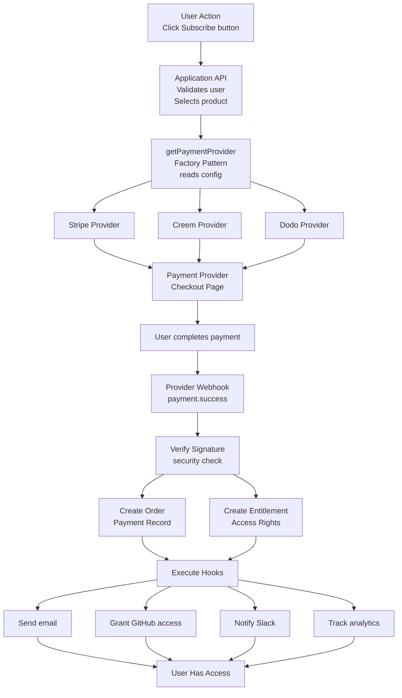
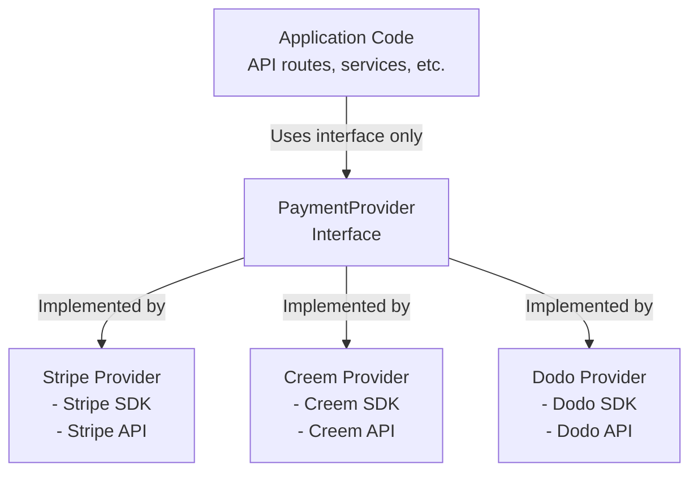
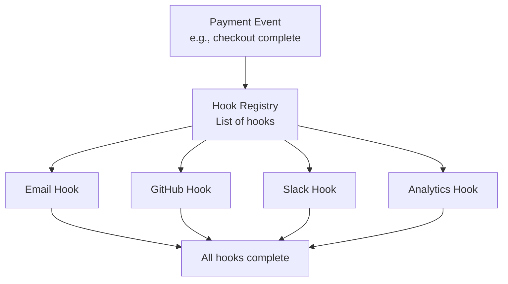
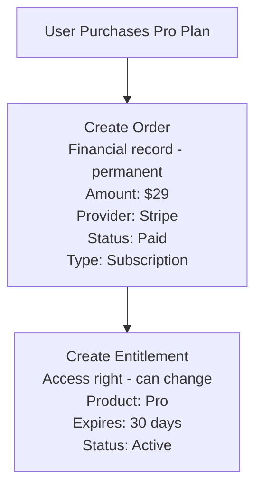
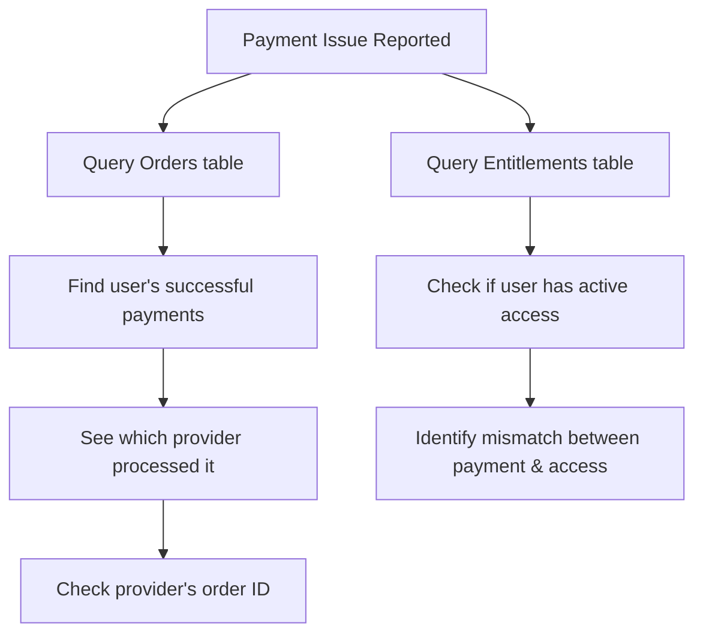
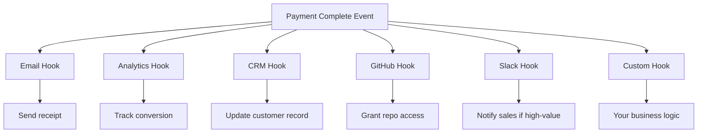

# Why I Built Custom Payment Integration Instead of Using Better Auth's Payment Plugin

When building [LaunchSaaS](https://github.com/LaunchSaasOrg/LaunchSaaS), I faced a critical decision: use Better Auth's built-in payment plugins or build my own payment system.

Better Auth is an excellent authentication library—we use it extensively for auth in LaunchSaaS. But when it came to payments, I chose to build custom. Here's why that decision paid off, and how you can determine the right choice for your project.

## What Better Auth's Payment Plugins Offer

First, let's be clear: **Better Auth's payment plugins are well-designed and feature-rich**. They're not some half-baked afterthought.

Better Auth supports multiple payment providers through dedicated plugins:

- **Stripe** (most popular)
- **Creem** (Asian markets)
- **Dodo** (alternative processor)
- **Polar** (developer-focused)
- ...

Each plugin provides a comprehensive subscription management system:

**Core Features:**

- Automatic customer creation with customizable parameters
- Subscription plan management (static definitions or dynamic fetching)
- Complete lifecycle handling (creation, upgrades, cancellations, restoration)
- Built-in trial period support with abuse prevention
- Team/organization subscriptions with seat management
- Billing portal access for customers
- Secure webhook processing with signature verification

**Customization Hooks:**

- `onSubscriptionComplete`, `onSubscriptionCreated`, `onSubscriptionUpdate`
- `onSubscriptionCancel`, `onSubscriptionDeleted`
- Trial events: `onTrialStart`, `onTrialEnd`, `onTrialExpired`
- Generic `onEvent` handler for custom webhook logic

For **subscription-first SaaS products** that stick with one payment provider, Better Auth's plugins solve 80% of your payment needs out of the box. They're deeply integrated with Better Auth's user/org system, production-ready, and require minimal code to set up.

## The Two Critical Limitations That Made Me Build Custom

Here's where things got complicated for LaunchSaaS. Better Auth's plugins have two architectural constraints that were dealbreakers:

### 1. Provider Lock-in Through Database Schema (The Dealbreaker)

This is the big one. **Each Better Auth payment plugin uses provider-specific database tables.**

When you install the Stripe plugin, it creates:

- `subscriptions`

Install the Creem plugin instead? You get:

- `creem_subscriptions`

Same for Dodo, Polar, and any other provider.

**Why this matters:**

Switching from Stripe to Creem isn't a config change—it's a **data migration project**. You need to:

1. Export all subscription data from Stripe tables
2. Transform the data to match Creem's schema
3. Import into Creem tables
4. Update all queries and code references
5. Pray nothing breaks in production

For LaunchSaaS, this was unacceptable:

- **Global SaaS flexibility** - Different markets have different payment provider preferences and regulations
- **Business flexibility** - If a provider raises fees 30% or changes terms, I don't want migration to be a nightmare
- **Testing complexity** - Can't easily test different providers in staging without separate databases
- **Risk mitigation** - Payment processors can shut down, change policies, or have outages

### 2. Subscription-Only, No One-Time Payments (Business Model Constraint)

Better Auth's payment plugins are **subscription-only**. They don't support:

- One-time purchases
- Hybrid models (subscription + one-time)
- Credit packs or top-ups

Look at successful SaaS products—many use hybrid monetization:

- **GitHub**: Monthly subscription + one-time purchases of extra Actions minutes
- **Notion**: Workspace subscription + one-time content packs
- **Design tools**: Monthly plan + purchasable template libraries
- **LaunchSaaS itself**: Plans to offer lifetime access option

The architecture of Better Auth's plugins assumes recurring billing. There's no `type` field for "one_time" vs "subscription". The entitlement model ties directly to active subscriptions.

**Important Note:** These aren't bugs or oversights. They're **intentional design decisions** that work perfectly for many projects. Better Auth optimized for the common case: subscription-first SaaS with a single payment provider. That's a great choice for 80% of projects.

LaunchSaaS just needed the other 20%.

## The LaunchSaaS Solution: Provider-Agnostic Payment Architecture

Here's how I designed LaunchSaaS's payment system to solve both problems.

### Architecture Overview

Before diving into specifics, here's the complete payment flow in LaunchSaaS:



**Key architectural components:**

1. **Provider Factory** - Selects the right provider based on configuration
2. **Provider Interface** - All providers implement the same methods
3. **Webhook Handler** - Provider-agnostic event processing
4. **Order Creation** - Unified financial record keeping
5. **Entitlement Creation** - Separate access right management
6. **Hook System** - Composable post-payment actions

Now let's break down each component.

### Unified Data Model (No Provider Lock-in)

Instead of provider-specific tables, LaunchSaaS uses a **single unified schema** that works with ANY payment provider.

The core insight is treating the payment provider as **metadata**, not as a structural component of your database.

**Key design principle:**

Traditional approach (like Better Auth) creates separate tables for each provider:

- When you use Stripe: you get `stripe_subscriptions` table
- When you use Creem: you get `creem_subscriptions` table
- Switching providers = migrating data between different table structures

LaunchSaaS approach:

- **One unified `orders` table** that stores payment records
- **Provider name is just a field** in the table (like "stripe", "creem", "dodo")
- Each order records which provider processed it
- Switching providers = changing configuration, not database structure

**Data model design:**

```
Order Record Concept:
├── Unique identifier
├── User reference
├── Provider name ← Just metadata!
├── Provider's order ID
├── Payment amount & currency
├── Payment status (pending/paid/failed)
├── Payment type (subscription/one-time)
└── Timestamps
```

**Real-world benefits:**

- **Switching from Stripe to Creem?** Update your config file, done
- **Using multiple providers?** No problem—each order knows its provider
- **Testing new providers?** Zero schema changes needed
- **Historical data?** All payments in one place regardless of provider

### PaymentProvider Interface (Strategy Pattern)

The second key to provider flexibility is a unified interface. All payment providers (Stripe, Creem, Dodo, etc.) implement the same contract:

```typescript
interface PaymentProvider {
  readonly name: string;

  // Core operations
  createCheckout(options: CheckoutOptions): Promise<CheckoutResult>;
  createBillingPortal(
    customerId: string,
    returnUrl: string,
  ): Promise<BillingPortalResult>;
  upgradeSubscription(options: UpgradeSubscriptionOptions): Promise<void>;
  cancelSubscription(subscriptionId: string): Promise<void>;

  // Webhook handling
  verifySignature(
    rawBody: string | Buffer,
    signature: string,
  ): Promise<boolean>;
  handleEvent(rawBody: string | Buffer): Promise<void>;
}
```

This is the **Strategy Pattern** from design patterns literature. The application code doesn't know or care which provider it's talking to—it just calls methods on the `PaymentProvider` interface.

**Architecture flow:**



**How it works in practice:**

1. **Configuration determines the provider** - Environment variable specifies which provider to use
2. **Factory returns the correct implementation** - A factory function reads the config and returns the appropriate provider class
3. **Application code is provider-agnostic** - Your checkout route calls generic interface methods, doesn't care about the underlying provider

**Benefits:**

- **Zero application code changes** when switching providers
- **Easy to test** - can mock the interface
- **Side-by-side comparison** - run Stripe in production, Creem in staging
- **Gradual migration** - old orders use Stripe, new orders use Creem

### Hook System (Composable Business Logic)

LaunchSaaS uses a **hook registry pattern** for pre/post-payment actions. This is similar to WordPress hooks or React lifecycle methods—you register functions that run at specific points in the payment flow.

**Hook interface definition:**

```typescript
interface PaymentHook {
  name: string;

  // Modify checkout before it's created
  getCheckoutSessionParams?(
    context: CheckoutSessionContext,
  ): Promise<Partial<CheckoutSessionParams>>;

  // Run after successful payment
  onCheckoutComplete?(context: AfterHookContext): Promise<void>;

  // Run when subscription is cancelled
  onSubscriptionCancel?(context: AfterHookContext): Promise<void>;
}
```

**How hooks work:**



**Example use cases:**

1. **Email notifications** - Send "payment successful" email
2. **GitHub access** - Grant repository access for paid users
3. **Slack alerts** - Notify sales team of high-value purchases
4. **Analytics** - Track conversion events
5. **CRM sync** - Update customer records

**Configuration approach:**

Hooks are assigned per product in configuration:

```
Product: "Pro Plan"
├── Hooks: ["payment-completed-email"]
└── Price: $29/month

Product: "Pro + GitHub Access"
├── Hooks: ["payment-completed-email", "github-integration"]
└── Price: $49/month
```

**Benefits:**

- **Composable** - Mix and match hooks for different products
- **Testable** - Each hook is an isolated, pure function
- **Maintainable** - Add new hooks without modifying core payment logic
- **Reusable** - Same hook can be used across multiple products

### Order vs. Entitlement Separation

LaunchSaaS separates **payment records** (Orders) from **access rights** (Entitlements). This is a critical architectural decision.

**The problem with coupling them:**

Better Auth's plugins store subscription data in the user/organization schema. This means payment information and access rights are tightly coupled—if you have an active subscription record, you have access.

**Why LaunchSaaS separates them:**

**Orders table** stores successful payment records:

- Successfully completed payments
- Which provider processed each transaction
- Amounts, currencies, timestamps
- Payment type (subscription or one-time)
- **Purpose**: Financial tracking, customer support, access grant history
- **Note**: Currently focuses on successful payments. Failed attempts can be logged separately. Features like refunds and disputes can be extended based on business needs.

**Entitlements table** stores what users can currently access:

- Which products/features a user has access to
- When access expires (or if it's lifetime)
- Current status (active, expired, cancelled)
- **Purpose**: Feature gating, permission checks, UI customization

**Real-world example flow:**



**Why this matters:**

1. **Support queries** - "Why don't I have access?"
   - Check Orders: Did payment succeed?
   - Check Entitlements: Is access still active?
   - Can debug independently

2. **Compliance** - Tax and financial regulations
   - Keep all payment records forever (Orders table)
   - Access can change without deleting financial history

3. **Lifetime deals**
   - Order: One-time payment of $299
   - Entitlement: `expiresAt = null` (never expires)

4. **Extensible for complex scenarios**
   - Current implementation handles core payment flows
   - Can be extended to handle refunds, disputes, chargebacks as needed
   - The separated model makes these additions straightforward

5. **Grace periods** (example extension)
   - Payment renewal fails
   - Entitlement stays active temporarily (grace period)
   - User can update payment method without losing data

**Comparison:**

| Aspect             | Better Auth   | LaunchSaaS          |
| ------------------ | ------------- | ------------------- |
| Payment = Access   | Yes (coupled) | No (separated)      |
| Historical records | Limited       | Successful payments |
| Lifetime access    | Difficult     | Natural             |
| Extensibility      | Fixed         | Easy to extend      |
| Support debugging  | Hard          | Straightforward     |

## Benefits We Actually Gained

### 1. Multi-Provider Flexibility

**Real scenario:** Launched LaunchSaaS with Stripe for US/EU customers. Later added Creem for Asian markets where Stripe adoption is lower.

**Time to add Creem:** 2 days (implement `CreemProvider` class)

**Migration effort:** Zero. Existing Stripe customers stayed on Stripe. New Asian users got Creem.

### 2. One-Time Payment Support

LaunchSaaS now offers flexible monetization models:

- Monthly/annual subscriptions (recurring billing)
- Lifetime access deals (one-time purchase)
- Credit top-ups (one-time purchase)

All payment types flow through the same unified system—the `orders` table simply records whether it's a subscription or one-time payment in a type field.

### 3. Easier Debugging

When debugging payment issues, the unified architecture makes troubleshooting straightforward.

**Debugging workflow:**



**Compare approaches:**

**Better Auth plugins:**

- Query `stripe_subscriptions` for Stripe users
- Query `creem_subscriptions` for Creem users
- Different schemas = different queries
- Cross-provider debugging requires joining multiple table structures

**LaunchSaaS:**

- One `orders` table for all providers
- One `entitlements` table for all access rights
- Same queries work regardless of provider
- The `provider` field tells you which service to check

**Real example:**
Customer complains: "I paid but don't have access"

1. Search orders by email → Find payment record
2. Verify payment was successful in Orders table
3. Check provider field: Was it Stripe or Creem?
4. Query entitlements: Does user have active access?
5. Identify the gap (payment succeeded but entitlement not created) and fix it

### 4. Hook System Extensibility

The hook system makes it trivial to add business logic without modifying core code.

**Scenario:** Product team wants Slack notifications when high-value customers subscribe.

**Better Auth approach:**

- Modify the global `onSubscriptionComplete` callback
- This affects ALL subscriptions
- Need conditional logic inside the shared callback
- Risks breaking existing functionality

**LaunchSaaS approach:**

- Create a new hook (isolated function)
- Register it only for enterprise-tier products
- Zero changes to core payment logic
- Other products unaffected

**Time to implement:** 15-20 minutes

**Hook flexibility examples:**



Each product can compose different hook combinations without affecting others.

### 5. Testing Different Providers

The provider abstraction makes testing incredibly flexible.

**Environment-based provider selection:**

- **Development**: Use Stripe test mode for local testing
- **Staging**: Use Creem to test Asian payment flows
- **Production**: Use Stripe for US/EU, Creem for Asia

**Same codebase, different providers—just change environment variables.**

**Benefits:**

- Test new providers without production risk
- A/B test provider conversion rates
- Gradually migrate users between providers
- Keep development and production isolated

## The Honest Trade-offs

### 1. Development Time

**Better Auth plugins:** ~2 days to integrate (mostly config)

**Custom system:** ~2 weeks initial build

- Week 1: Core architecture (provider interface, factory, base class)
- Week 2: Stripe + Creem implementations, webhook handling, hooks

**Break-even point:** When I needed to add Creem (month 3). The 2-week investment paid off.

**For LaunchSaaS users:** You get 2 weeks of my work for free.

### 2. Maintenance Burden

**Reality check:** I own this code.

When Stripe releases API v2025:

- Better Auth plugin users: Wait for plugin update
- LaunchSaaS: I update `StripeProvider` class myself

**Trade-off:** More control, more responsibility.

**Mitigation:**

- Provider logic is isolated (contained in one file)
- Interface is stable (breaking changes are rare)
- Good test coverage (catch issues early)

### 3. Testing Complexity

Custom system needs more tests:

- Unit tests for each provider implementation
- Integration tests for webhook processing
- End-to-end tests for checkout flows

**Lines of test code:** ~500 (vs ~50 with Better Auth plugins)

**But:** Better confidence in production. I can refactor aggressively.

## Should YOU Use Better Auth's Plugins or Build Custom?

Here's my decision framework.

### ✅ Use Better Auth's Payment Plugins If:

- **Subscription-only business model** - No plans for one-time payments, lifetime deals, or credits
- **Single provider commitment** - You're confident Stripe (or your chosen provider) will serve you forever
- **Standard SaaS patterns** - Monthly/annual plans without complex customization
- **MVP/early stage** - Speed to market matters more than architectural flexibility
- **Small team** - Limited dev resources, can't dedicate time to custom payment infrastructure
- **Regional focus** - Only targeting markets where one provider dominates (e.g., US/EU with Stripe)

**The plugins are excellent for this use case.** Don't overthink it.

### ✅ Build Custom Payment System If:

- **Need one-time payments** - Lifetime deals, credit packs, add-ons, or hybrid models
- **Multi-provider requirement** - Global markets, testing multiple providers, or risk mitigation
- **Provider switching flexibility** - Don't want to be locked into one provider's database schema
- **Complex business logic** - Extensive hooks, conditional flows, or custom integrations
- **Compliance/audit requirements** - Need clear separation of payment records and access rights
- **Payment is core to business** - Worth the investment to own this infrastructure
- **Medium+ team** - Can dedicate 1-2 weeks initial build + ongoing maintenance

### The Key Question

**"Will I ever need to support one-time payments OR switch payment providers?"**

- **Yes to either** → Custom system is worth it (or use LaunchSaaS)
- **No to both** → Better Auth's plugins are perfect

## How LaunchSaaS Makes This Easy

If you're building a SaaS and need this flexibility, LaunchSaaS gives you this system out of the box:

**What's included:**

- Provider abstraction with Stripe + Creem pre-integrated
- Hook system with example hooks (email, GitHub integration)
- Order + Entitlement models with migrations
- Webhook handling with signature verification
- Admin UI for viewing orders and managing entitlements
- One-time + subscription payment support

**Time saved:** 2 weeks of architecture + implementation → 5 minutes of configuration

Check it out: [LaunchSaas](https://github.com/LaunchSaasOrg/saas)

## Lessons Learned

1. **Abstractions are worth the investment** - But only for core business logic. Payment infrastructure is core for SaaS.

2. **Plugins are great for 80% of use cases** - Better Auth's plugins are well-designed. Know when you're in the 20% that needs custom.

3. **Design for extensibility early** - The hook system took 2 extra days upfront, saved weeks in feature development later.

4. **Separation of concerns matters** - Payment ≠ Authentication ≠ Authorization. Don't couple them through shared schemas.

5. **Provider lock-in is real** - Database schemas that assume a specific provider create hidden migration costs. Abstract early.

## Final Thoughts

Better Auth is an excellent library, and their payment plugins are well-designed for subscription-first SaaS. If that's your model, use them without hesitation.

LaunchSaaS needed different trade-offs: provider flexibility and one-time payment support. Building custom gave us that, at the cost of initial development time.

**The best architecture is the one that solves YOUR problem**, not the one that's easiest to set up.

Know your requirements. Choose accordingly.

---

**Building a SaaS?** Check out [LaunchSaaS](https://github.com/LaunchSaasOrg/saas) - get this payment system (and a complete SaaS stack) out of the box.

**Questions or feedback?** Drop a comment or reach out on Twitter/X: [@victorymakes](https://x.com/victorymakes)
