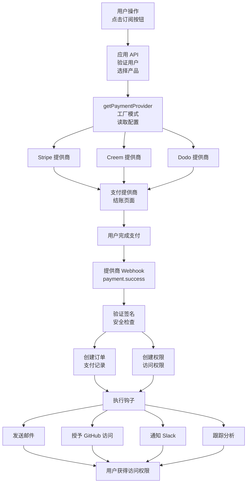
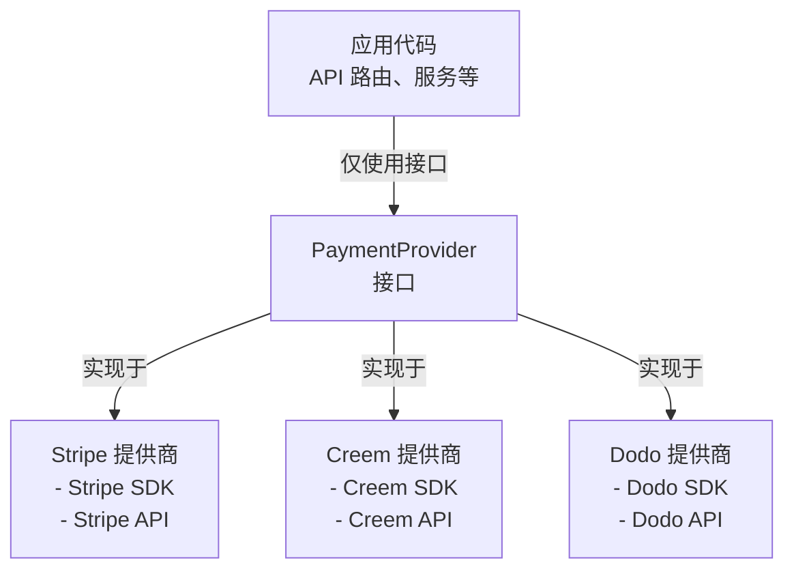
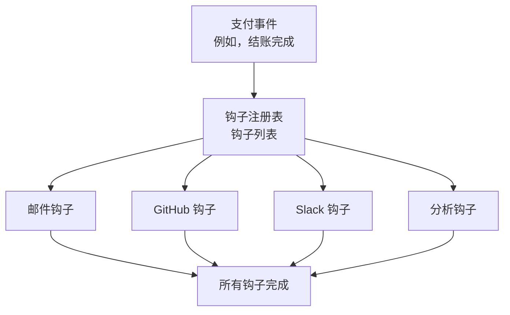
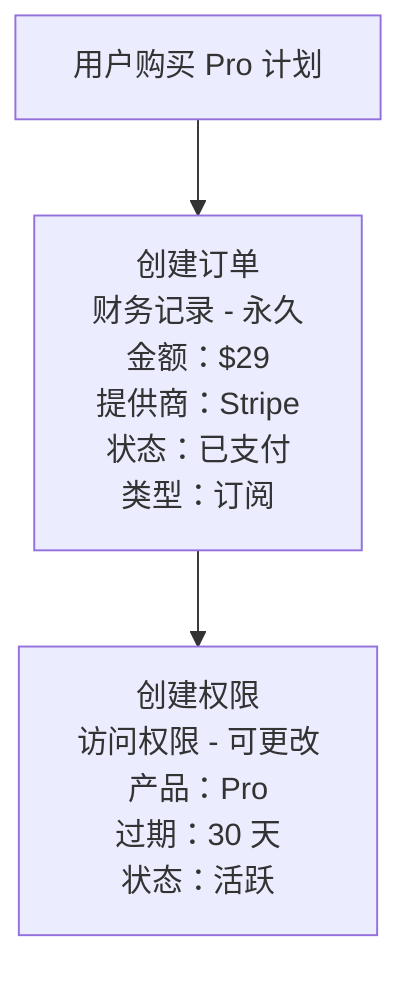
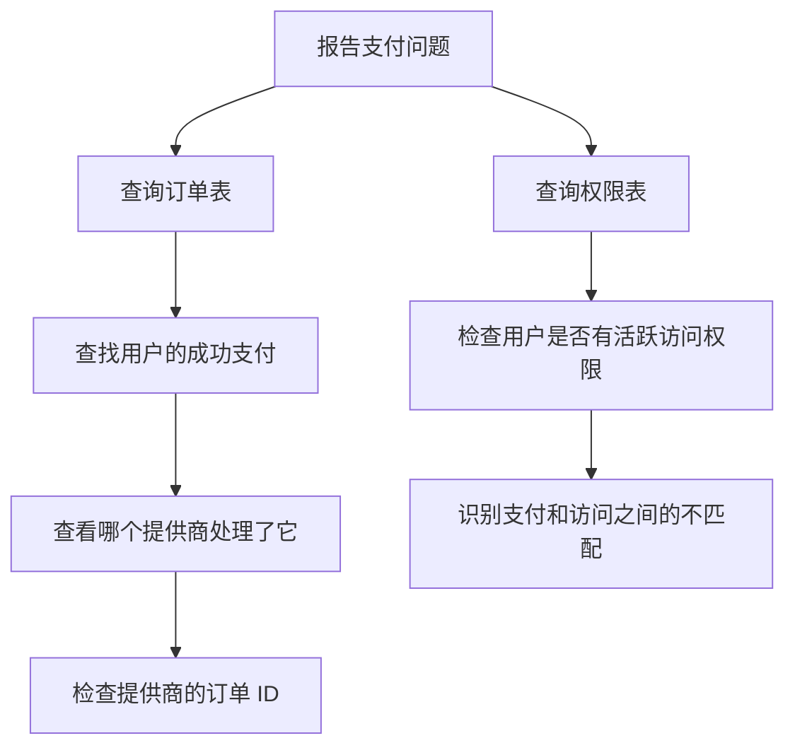
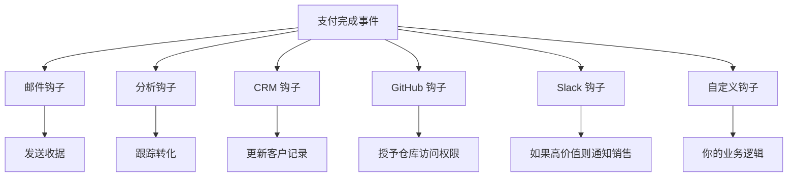

# 为什么我选择自建支付集成而不是使用 Better Auth 的支付插件

在构建 [LaunchSaaS](https://github.com/LaunchSaasOrg/saas) 时，我面临一个关键决策：使用 Better Auth 内置的支付插件，还是自建支付系统。

Better Auth 是一个优秀的认证库——我们在 LaunchSaaS 中广泛使用它来处理身份验证。但在支付方面，我选择了自建。以下是这个决策带来的回报，以及如何判断适合你项目的正确选择。

## Better Auth 支付插件提供了什么

首先要明确：**Better Auth 的支付插件设计精良且功能丰富**。它们不是什么半成品。

Better Auth 通过专用插件支持多个支付提供商：

- **Stripe**（最受欢迎）
- **Creem**（亚洲市场）
- **Dodo**（替代处理器）
- **Polar**（面向开发者）
- ...

每个插件都提供完整的订阅管理系统：

**核心功能：**

- 自动创建客户，支持自定义参数
- 订阅计划管理（静态定义或动态获取）
- 完整的生命周期处理（创建、升级、取消、恢复）
- 内置试用期支持，带防滥用机制
- 团队/组织订阅，支持席位管理
- 客户账单门户访问
- 安全的 webhook 处理，带签名验证

**自定义钩子：**

- `onSubscriptionComplete`、`onSubscriptionCreated`、`onSubscriptionUpdate`
- `onSubscriptionCancel`、`onSubscriptionDeleted`
- 试用事件：`onTrialStart`、`onTrialEnd`、`onTrialExpired`
- 通用 `onEvent` 处理器，用于自定义 webhook 逻辑

对于**订阅优先的 SaaS 产品**且只使用一个支付提供商的项目，Better Auth 的插件开箱即用地解决了 80% 的支付需求。它们与 Better Auth 的用户/组织系统深度集成，生产就绪，且只需最少的代码即可设置。

## 让我选择自建的两个关键限制

对于 LaunchSaaS 来说，情况变得复杂了。Better Auth 的插件有两个架构约束，成为了交易破坏者：

### 1. 通过数据库架构锁定提供商（致命缺陷）

这是最大的问题。**每个 Better Auth 支付插件都使用特定于提供商的数据库表。**

当你安装 Stripe 插件时，它会创建：

- `subscriptions`

安装 Creem 插件呢？你会得到：

- `creem_subscriptions`

Dodo、Polar 和其他提供商也是如此。

**为什么这很重要：**

从 Stripe 切换到 Creem 不是配置更改——而是**数据迁移项目**。你需要：

1. 从 Stripe 表导出所有订阅数据
2. 转换数据以匹配 Creem 的架构
3. 导入到 Creem 表
4. 更新所有查询和代码引用
5. 祈祷生产环境不出问题

对于 LaunchSaaS 来说，这是不可接受的：

- **全球 SaaS 灵活性** - 不同市场有不同的支付提供商偏好和法规
- **业务灵活性** - 如果提供商涨价 30% 或更改条款，我不希望迁移成为噩梦
- **测试复杂性** - 无法在测试环境中轻松测试不同提供商，除非使用单独的数据库
- **风险缓解** - 支付处理器可能关闭、更改政策或出现故障

### 2. 仅支持订阅，不支持一次性付款（业务模式约束）

Better Auth 的支付插件**仅支持订阅**。它们不支持：

- 一次性购买
- 混合模式（订阅 + 一次性）
- 积分包或充值

看看成功的 SaaS 产品——许多使用混合货币化：

- **GitHub**：月度订阅 + 一次性购买额外的 Actions 分钟数
- **Notion**：工作区订阅 + 一次性内容包
- **设计工具**：月度计划 + 可购买的模板库
- **LaunchSaaS 本身**：计划提供终身访问选项

Better Auth 插件的架构假设循环计费。没有用于"一次性"与"订阅"的 `type` 字段。权限模型直接与活跃订阅绑定。

**重要说明：** 这些不是 bug 或疏忽。它们是**有意的设计决策**，对许多项目来说完美适用。Better Auth 针对常见情况进行了优化：使用单一支付提供商的订阅优先 SaaS。这对 80% 的项目来说是个很好的选择。

LaunchSaaS 只是需要另外的 20%。

## LaunchSaaS 解决方案：提供商无关的支付架构

以下是我如何设计 LaunchSaaS 的支付系统来解决这两个问题。

### 架构概览

在深入细节之前，这是 LaunchSaaS 中完整的支付流程：



**关键架构组件：**

1. **提供商工厂** - 根据配置选择正确的提供商
2. **提供商接口** - 所有提供商实现相同的方法
3. **Webhook 处理器** - 提供商无关的事件处理
4. **订单创建** - 统一的财务记录保存
5. **权限创建** - 独立的访问权限管理
6. **钩子系统** - 可组合的支付后操作

现在让我们分解每个组件。

### 统一数据模型（无提供商锁定）

LaunchSaaS 使用**单一统一架构**，而不是特定于提供商的表，可与任何支付提供商配合使用。

核心见解是将支付提供商视为**元数据**，而不是数据库的结构组件。

**关键设计原则：**

传统方法（如 Better Auth）为每个提供商创建单独的表：

- 使用 Stripe 时：得到 `stripe_subscriptions` 表
- 使用 Creem 时：得到 `creem_subscriptions` 表
- 切换提供商 = 在不同表结构之间迁移数据

LaunchSaaS 方法：

- **一个统一的 `orders` 表**存储支付记录
- **提供商名称只是一个字段**（如"stripe"、"creem"、"dodo"）
- 每个订单记录哪个提供商处理了它
- 切换提供商 = 更改配置，而不是数据库结构

**数据模型设计：**

```
订单记录概念：
├── 唯一标识符
├── 用户引用
├── 提供商名称 ← 只是元数据！
├── 提供商的订单 ID
├── 支付金额和货币
├── 支付状态（待处理/已支付/失败）
├── 支付类型（订阅/一次性）
└── 时间戳
```

**实际好处：**

- **从 Stripe 切换到 Creem？** 更新配置文件即可
- **使用多个提供商？** 没问题——每个订单都知道它的提供商
- **测试新提供商？** 无需架构更改
- **历史数据？** 所有支付记录在一个地方，无论提供商

### PaymentProvider 接口（策略模式）

提供商灵活性的第二个关键是统一接口。所有支付提供商（Stripe、Creem、Dodo 等）都实现相同的契约：

```typescript
interface PaymentProvider {
  readonly name: string;

  // 核心操作
  createCheckout(options: CheckoutOptions): Promise<CheckoutResult>;
  createBillingPortal(
    customerId: string,
    returnUrl: string,
  ): Promise<BillingPortalResult>;
  upgradeSubscription(options: UpgradeSubscriptionOptions): Promise<void>;
  cancelSubscription(subscriptionId: string): Promise<void>;

  // Webhook 处理
  verifySignature(
    rawBody: string | Buffer,
    signature: string,
  ): Promise<boolean>;
  handleEvent(rawBody: string | Buffer): Promise<void>;
}
```

这是设计模式文献中的**策略模式**。应用程序代码不知道也不关心它在与哪个提供商交互——它只是调用 `PaymentProvider` 接口上的方法。

**架构流程：**



**实践中的工作原理：**

1. **配置决定提供商** - 环境变量指定使用哪个提供商
2. **工厂返回正确的实现** - 工厂函数读取配置并返回适当的提供商类
3. **应用代码与提供商无关** - 你的结账路由调用通用接口方法，不关心底层提供商

**好处：**

- **切换提供商时零应用代码更改**
- **易于测试** - 可以模拟接口
- **并行比较** - 生产环境运行 Stripe，测试环境运行 Creem
- **逐步迁移** - 旧订单使用 Stripe，新订单使用 Creem

### 钩子系统（可组合的业务逻辑）

LaunchSaaS 使用**钩子注册模式**进行支付前/后操作。这类似于 WordPress 钩子或 React 生命周期方法——你注册在支付流程特定点运行的函数。

**钩子接口定义：**

```typescript
interface PaymentHook {
  name: string;

  // 在创建结账之前修改它
  getCheckoutSessionParams?(
    context: CheckoutSessionContext,
  ): Promise<Partial<CheckoutSessionParams>>;

  // 支付成功后运行
  onCheckoutComplete?(context: AfterHookContext): Promise<void>;

  // 订阅取消时运行
  onSubscriptionCancel?(context: AfterHookContext): Promise<void>;
}
```

**钩子的工作原理：**



**示例用例：**

1. **邮件通知** - 发送"支付成功"邮件
2. **GitHub 访问** - 为付费用户授予仓库访问权限
3. **Slack 警报** - 通知销售团队高价值购买
4. **分析** - 跟踪转化事件
5. **CRM 同步** - 更新客户记录

**配置方法：**

钩子按产品在配置中分配：

```
产品："Pro 计划"
├── 钩子：["payment-completed-email"]
└── 价格：$29/月

产品："Pro + GitHub 访问"
├── 钩子：["payment-completed-email", "github-integration"]
└── 价格：$49/月
```

**好处：**

- **可组合** - 为不同产品混合和匹配钩子
- **可测试** - 每个钩子都是一个独立的纯函数
- **可维护** - 添加新钩子无需修改核心支付逻辑
- **可重用** - 同一个钩子可以在多个产品中使用

### 订单与权限分离

LaunchSaaS 将**支付记录**（订单）与**访问权限**（权限）分开。这是一个关键的架构决策。

**耦合它们的问题：**

Better Auth 的插件将订阅数据存储在用户/组织架构中。这意味着支付信息和访问权限紧密耦合——如果你有活跃的订阅记录，你就有访问权限。

**为什么 LaunchSaaS 要分离它们：**

**订单表**存储成功的支付记录：

- 成功完成的支付
- 哪个提供商处理了每笔交易
- 金额、货币、时间戳
- 支付类型（订阅或一次性）
- **用途**：财务跟踪、客户支持、访问授予历史
- **注意**：当前专注于成功的支付。失败的尝试可以单独记录。退款和争议等功能可以根据业务需求扩展。

**权限表**存储用户当前可以访问的内容：

- 用户可以访问哪些产品/功能
- 访问何时过期（或是否为终身）
- 当前状态（活跃、过期、已取消）
- **用途**：功能门控、权限检查、UI 定制

**实际示例流程：**



**为什么这很重要：**

1. **支持查询** - "为什么我没有访问权限？"
   - 检查订单：支付是否成功？
   - 检查权限：访问权限是否仍然活跃？
   - 可以独立调试

2. **合规性** - 税收和财务法规
   - 永久保留所有支付记录（订单表）
   - 访问权限可以更改而不删除财务历史

3. **终身交易**
   - 订单：一次性支付 $299
   - 权限：`expiresAt = null`（永不过期）

4. **可扩展用于复杂场景**
   - 当前实现处理核心支付流程
   - 可以根据需要扩展以处理退款、争议、退单
   - 分离的模型使这些添加变得直接

5. **宽限期**（示例扩展）
   - 支付续订失败
   - 权限暂时保持活跃（宽限期）
   - 用户可以更新支付方式而不会丢失数据

**对比：**

| 方面        | Better Auth | LaunchSaaS |
| ----------- | ----------- | ---------- |
| 支付 = 访问 | 是（耦合）  | 否（分离） |
| 历史记录    | 有限        | 成功的支付 |
| 终身访问    | 困难        | 自然       |
| 可扩展性    | 固定        | 易于扩展   |
| 支持调试    | 困难        | 直接       |

## 我们实际获得的好处

### 1. 多提供商灵活性

**真实场景：** 使用 Stripe 为美国/欧盟客户推出 LaunchSaaS。后来为 Stripe 采用率较低的亚洲市场添加了 Creem。

**添加 Creem 的时间：** 2 天（实现 `CreemProvider` 类）

**迁移工作量：** 零。现有的 Stripe 客户继续使用 Stripe。新的亚洲用户使用 Creem。

### 2. 一次性付款支持

LaunchSaaS 现在提供灵活的货币化模式：

- 月度/年度订阅（循环计费）
- 终身访问交易（一次性购买）
- 积分充值（一次性购买）

所有支付类型都通过相同的统一系统流动——`orders` 表只需在类型字段中记录它是订阅还是一次性支付。

### 3. 更容易调试

调试支付问题时，统一架构使故障排除变得直接。

**调试工作流程：**



**比较方法：**

**Better Auth 插件：**

- 为 Stripe 用户查询 `stripe_subscriptions`
- 为 Creem 用户查询 `creem_subscriptions`
- 不同的架构 = 不同的查询
- 跨提供商调试需要连接多个表结构

**LaunchSaaS：**

- 所有提供商使用一个 `orders` 表
- 所有访问权限使用一个 `entitlements` 表
- 无论提供商如何，相同的查询都有效
- `provider` 字段告诉你要检查哪个服务

**真实示例：**
客户投诉："我付了款但没有访问权限"

1. 通过邮箱搜索订单 → 找到支付记录
2. 在订单表中验证支付成功
3. 检查提供商字段：是 Stripe 还是 Creem？
4. 查询权限：用户是否有活跃访问权限？
5. 识别差距（支付成功但未创建权限）并修复

### 4. 钩子系统可扩展性

钩子系统使得在不修改核心代码的情况下添加业务逻辑变得简单。

**场景：** 产品团队希望在高价值客户订阅时收到 Slack 通知。

**Better Auth 方法：**

- 修改全局 `onSubscriptionComplete` 回调
- 这会影响所有订阅
- 需要在共享回调中使用条件逻辑
- 有破坏现有功能的风险

**LaunchSaaS 方法：**

- 创建一个新钩子（独立函数）
- 仅为企业级产品注册它
- 核心支付逻辑零更改
- 其他产品不受影响

**实现时间：** 15-20 分钟

**钩子灵活性示例：**



每个产品可以组合不同的钩子组合而不影响其他产品。

### 5. 测试不同提供商

提供商抽象使测试变得非常灵活。

**基于环境的提供商选择：**

- **开发环境**：使用 Stripe 测试模式进行本地测试
- **测试环境**：使用 Creem 测试亚洲支付流程
- **生产环境**：美国/欧盟使用 Stripe，亚洲使用 Creem

**相同代码库，不同提供商——只需更改环境变量。**

**好处：**

- 无生产风险地测试新提供商
- A/B 测试提供商转化率
- 在提供商之间逐步迁移用户
- 保持开发和生产环境隔离

## 诚实的权衡

### 1. 开发时间

**Better Auth 插件：** ~2 天集成（主要是配置）

**自定义系统：** ~2 周初始构建

- 第 1 周：核心架构（提供商接口、工厂、基类）
- 第 2 周：Stripe + Creem 实现、webhook 处理、钩子

**收支平衡点：** 当我需要添加 Creem 时（第 3 个月）。2 周的投资得到了回报。

**对于 LaunchSaaS 用户：** 你可以免费获得我 2 周的工作。

### 2. 维护负担

**现实检查：** 我拥有这些代码。

当 Stripe 发布 API v2025 时：

- Better Auth 插件用户：等待插件更新
- LaunchSaaS：我自己更新 `StripeProvider` 类

**权衡：** 更多控制，更多责任。

**缓解措施：**

- 提供商逻辑是隔离的（包含在一个文件中）
- 接口是稳定的（破坏性更改很少见）
- 良好的测试覆盖率（及早发现问题）

### 3. 测试复杂性

自定义系统需要更多测试：

- 每个提供商实现的单元测试
- webhook 处理的集成测试
- 结账流程的端到端测试

**测试代码行数：** ~500（与 Better Auth 插件的 ~50 相比）

**但是：** 对生产更有信心。我可以积极重构。

## 你应该使用 Better Auth 插件还是自建？

这是我的决策框架。

### ✅ 使用 Better Auth 支付插件，如果：

- **仅订阅业务模式** - 不打算提供一次性支付、终身交易或积分
- **单一提供商承诺** - 你确信 Stripe（或你选择的提供商）将永远为你服务
- **标准 SaaS 模式** - 月度/年度计划，无复杂定制
- **MVP/早期阶段** - 上市速度比架构灵活性更重要
- **小团队** - 开发资源有限，无法投入时间构建自定义支付基础设施
- **区域聚焦** - 仅针对一个提供商占主导地位的市场（例如，使用 Stripe 的美国/欧盟）

**插件对于这种用例非常出色。** 不要过度思考。

### ✅ 构建自定义支付系统，如果：

- **需要一次性付款** - 终身交易、积分包、附加组件或混合模式
- **多提供商需求** - 全球市场、测试多个提供商或风险缓解
- **提供商切换灵活性** - 不想被锁定在一个提供商的数据库架构中
- **复杂的业务逻辑** - 广泛的钩子、条件流程或自定义集成
- **合规/审计要求** - 需要清楚分离支付记录和访问权限
- **支付是业务核心** - 值得投资拥有这个基础设施
- **中等以上团队** - 可以投入 1-2 周初始构建 + 持续维护

### 关键问题

**"我是否需要支持一次性付款或切换支付提供商？"**

- **任一个答案是** → 自定义系统值得（或使用 LaunchSaaS）
- **两个都否** → Better Auth 的插件完美

## LaunchSaaS 如何让这变得简单

如果你正在构建 SaaS 并需要这种灵活性，LaunchSaaS 为你提供了开箱即用的系统：

**包含内容：**

- 提供商抽象，预集成 Stripe + Creem
- 钩子系统，带示例钩子（邮件、GitHub 集成）
- 订单 + 权限模型，带迁移
- Webhook 处理，带签名验证
- 查看订单和管理权限的管理 UI
- 一次性 + 订阅支付支持

**节省时间：** 2 周的架构 + 实现 → 5 分钟的配置

查看：[LaunchSaas](https://github.com/LaunchSaasOrg/saas)

## 经验教训

1. **抽象值得投资** - 但仅限于核心业务逻辑。支付基础设施是 SaaS 的核心。

2. **插件对 80% 的用例很棒** - Better Auth 的插件设计精良。知道你何时属于需要自定义的 20%。

3. **尽早设计可扩展性** - 钩子系统在前期多花了 2 天，后来在功能开发中节省了数周。

4. **关注点分离很重要** - 支付 ≠ 认证 ≠ 授权。不要通过共享架构耦合它们。

5. **提供商锁定是真实的** - 假设特定提供商的数据库架构会产生隐藏的迁移成本。尽早抽象。

## 最后的想法

Better Auth 是一个优秀的库，他们的支付插件对于订阅优先的 SaaS 设计精良。如果这是你的模式，毫不犹豫地使用它们。

LaunchSaaS 需要不同的权衡：提供商灵活性和一次性支付支持。自建给了我们这些，代价是初始开发时间。

**最好的架构是解决你的问题的架构**，而不是最容易设置的架构。

了解你的需求。相应选择。

---

**正在构建 SaaS？** 查看 [LaunchSaaS](https://github.com/LaunchSaasOrg/saas) - 开箱即用地获得这个支付系统（以及完整的 SaaS 技术栈）。

**有问题或反馈？** 留下评论或在 Twitter/X 上联系：[@victorymakes](https://x.com/victorymakes)
